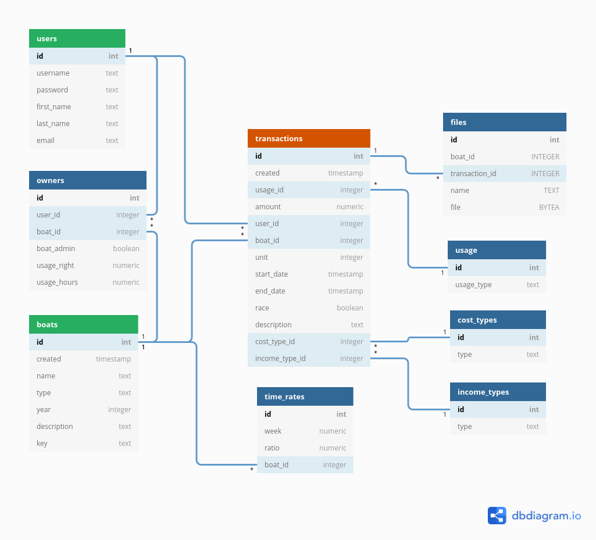

Tämä on HY Tietokantasovellus syksy 2021 kurssityö. Kurssin tavoitteena on rakentaa ja julkaista Herokussa toimiva web-sovellus PythoninFlask-kirjastoa ja PostgreSQL-tietokantaa hyödyntäen.

## Kimppavene -sovellus
Kimppavene on sovellus yhteisomistuksessa olevan veneen käyttövuorojen, talkootöiden ja kulujen seurantaan ja hallintaan.

## Toiminnallisuudet
- Palveluun voi luoda käyttäjätilin ja käyttäjä voi kirjautua sisään.
- Käyttäjä voi luoda tiliinsä liittyvän uuden veneen, jonka osakas hän on. Käyttäjä voi olla osakkaana useammassa kuin yhdessä veneessä.
- Käyttäjä voi liittyä osakkaaksi olemassaolevaan veneeseen syöttämällä toiselta osakkaalta saamansa veneen avainkoodin järjestelmään.

- Veneelle voi määritellä yhden tai useampia pääkäyttäjiä, jotka voivat muokata veneen tietoja. Veneen luonut käyttäjä määrittyy aina luomansa veneen pääkäyttäjäksi.
- Veneen pääkäyttäjä voi antaa muille veneen osakkaille pääkäyttäjän oikeudet.
- Käyttäjä voi tallentaa veneen tietoihin tiedostoja kuten käyttöohjeita, kuvia ja osakkaiden keskinäisiä sopimuksia.
- Käyttäjä voi tehdä tapahtumakirjauksia veneelle. Kirjattavat tapahtumat ovat käyttö, talkootyö ja kustannukset.
- Järjestelmässä on raporttinäkymiä, joista veneen osakas voi seurata omaa ja muiden saman veneen osakkaiden käyttöä. Veneen käyttömäärä, tehtyjen talkootuntien määrä ja osakas- / venekohtaiset kulut ja investoinnit.

## Optiota lisäominaisuuksista
- Käyttöoikeuskirjanpito. Veneelle voi määritellä käyttäjäkohtaisen, vuosittaisen oletuskäyttöoikeuden. Talkoopäivät kasvattavat käyttöoikeutta ja käyttö vähentää.
- Käyttöoikeuksille voi määritellä kertoimet eri viikoille. Lomakaudella käyttö syö enemmän käyttöoikeutta.
- Käyttäjä voi tehdä veneelle vuotuisen budjetin, jonka toteutumista voidaan seurata raporttinäkymässä.
- Varauskalenteri, jossa osakkaat voivat varata veneen käyttövuoroja.
- Varauskalenterin tapahtuman voi merkitä toteutuneeksi, jolloin se muuttuu tapahtumakirjaukseksi

## Luonnos tietokantakaaviosta
 </img>
